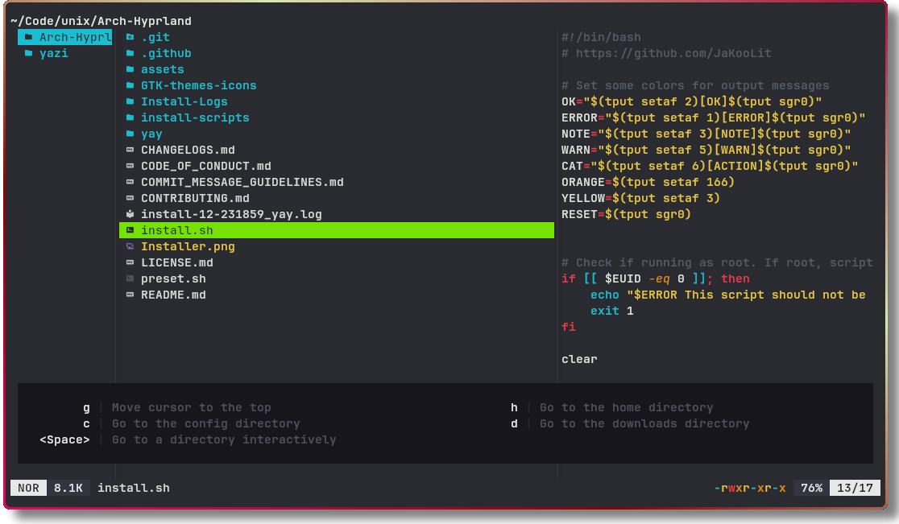

<div align="center">
  
</div>

<h3 align="center">
	Flavor for <a href="https://github.com/sxyazi/yazi">Yazi</a>
</h3>

## Why?
I like <s>Monokai</s>Gruvbox. I like Gruvbox with vibrant colors and a clean look even more.

## Credits
This theme/flavour was based on sanjinso's **Monokai Vibrant**, which was in turn based on jonotansberg <a href="https://github.com/jonatansberg/Monokai-Dark-Soda.tmTheme">tweaked Monokai Dark Soda</a> .tmTheme. 

## Preview



## Installation

<s>Using the Ya package manager:</s>
```bash
ya pkg add Octaeon/gruvbox.yazi
```
Actually, no - the structure of this repository doesn't mesh well with how ya works.
Oh well - maybe I'll fix it in the future


Using Nix Flakes:
```nix
{
  inputs = {
    # Other inputs

    gruvbox.url = "https://github.com/Octaeon/gruvbox.yazi";
    # For assurance, pin the version of nixpkgs
    inputs.nixpkgs.follows = "nixpkgs";
  };

  outputs = {gruvbox, ...}: {
    # I'm not going to explain how to create a whole configuration here, sorry

    # Home manager configuration
    programs.yazi = {
      enable = true;
      flavours = { 
        gruv = gruvbox.packages.x86_64-linux.default;
      };
    };
  };
}
```

See all Home Manager configuration options for yazi <a href="https://nix-community.github.io/home-manager/options.xhtml#opt-programs.yazi.enable">Here</a> 

## Usage

Add the these lines to your `theme.toml` configuration file to use it:

```toml
[flavor]
use = "monokai-vibrant"
```

## License

The flavor is MIT-licensed, and the included tmTheme is also MIT-licensed.

Check the [LICENSE](LICENSE) and [LICENSE-tmtheme](LICENSE-tmtheme) file for more details.
